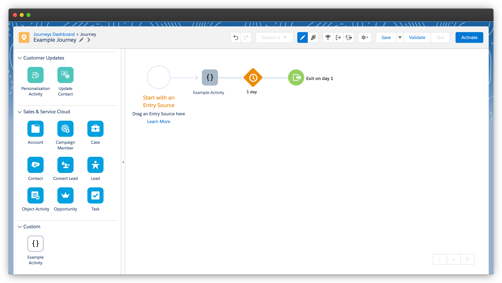
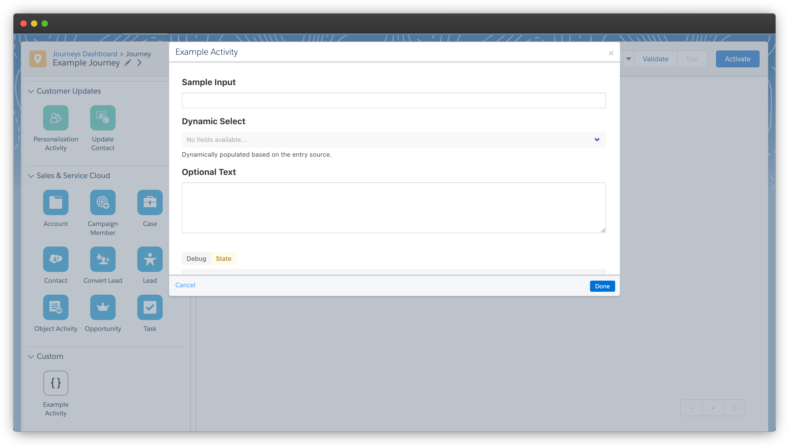
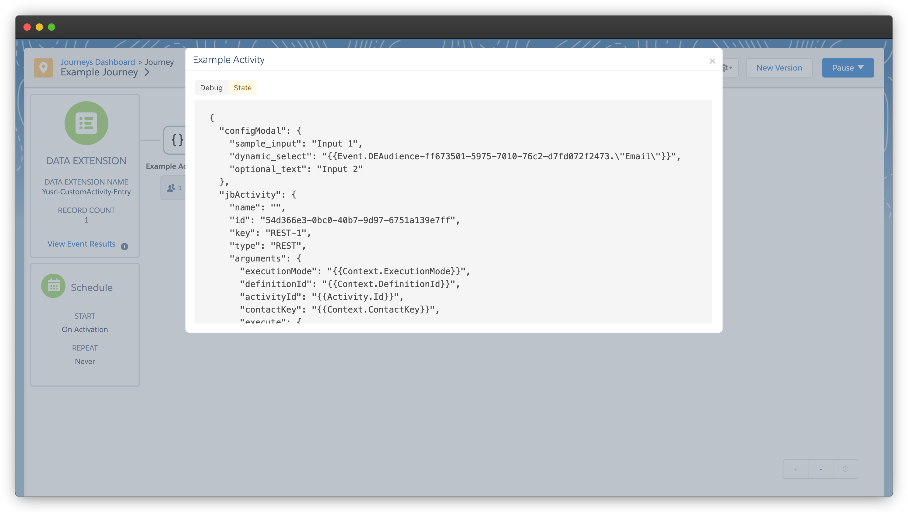

# [Template] Marketing Cloud Journey Builder Activity
Salesforce Marketing Cloud is a powerful marketing automation platform. One of its key features is Journey Builder which enables businesses to build, automate, and optimise customer journeys.

Custom Journey Builder activities provide an opportunity to extend the functionality of Journey Builder by integrating your product's features or custom actions into the marketing automation process.

> This repository is designed to kickstart the development of custom activities for Salesforce Marketing Cloud Journey Builder, useful for product development and software-as-a-service (SaaS).


[](https://heroku.com/deploy)
[](https://render.com/deploy)

## Project Setup
### Script Commands:
Install project dependencies:
```
npm install
```

Run the Express server locally:
```
npm run serve
```

Debug the Vue app front-end:
```
npm run dev
```

Start the Express server:
```
npm start
```

### Environment Variables:
| Variable | Description | Required | Sample Value |
|---|---|---|---|
| NODE_ENV | Environment identifier used for conditional logic. | ❌ | staging |
| NODE_VERSION | Required depending on hosting. | 🤔 | 18.15.0 |
| PORT | Express server port. | ❌ |  |
| VUE_APP_URL | Express server URL. | ✅ | https://xyz.onrender.com/ |
| VUE_APP_TITLE | Journey Builder activity name. | ✅ | Example Activity |
| SFMC_MID |  Business Unit MID(s) where the Installed Packaged is enabled. | ✅ | 500042165 |
| SFMC_TENANT |  Business Unit Tenant Subdomain(s). | ✅ | mcvnkblwyrzgidx3m-u2qpk-tsfh |
| SFMC_CLIENT |  Installed Package Client ID(s). | ✅ | zp9hxgqo84e2nyz26rpkp3m9 |
| SFMC_SECRET |  Installed Package Secret Key(s). | ✅ | xqYZXcBhJ39sLmPxRvVkdGqR |
| SFMC_LOG_DE |  Data Extension External Key(s). Shared Data Extensions can be used across MID's in the same enterprise. | ✅ | A2E9F753-6D1C-4B8F-A1CD-9C408BF2E7A0 |
| JB_TIMEOUT | Milliseconds before each rest activity in the journey times out. Must be from 1000 to 100000 milliseconds. | ❌ | 20000 |
| JB_RETRY_COUNT | Times to retry each rest activity in the journey after the rest activity times out. Must be from 0 to 5. | ❌ | 0 |
| JB_RETRY_DELAY | Milliseconds before each rest activity in the journey is retried. Must be from 0 to 10000 milliseconds. | ❌ | 1000 |
| JB_CONCURRENT_REQUESTS | How many rest activities to run in parallel. Must be from 1 to 10. | ❌ | 5 |
| TREBLLE_PROJECT | Treblle Project ID.  | ❌ | pQr3XsT4uV5wYz6 |
| TREBLLE_KEY | Treblle API Key. | ❌ | gA3wMzxRQpLsYb1eXsNhFd2VoTkQUZkf |

## Marketing Cloud Setup
### Create and Install Packages:
In Marketing Cloud, go to *Setup | Apps | Installed Packages*:

1. Click New.
2. Give the package a name and description.
3. Click Save.

#### API Integration > Server-to-Server
Adding a server-to-server component allows our server to interact with Marketing Cloud i.e. validate a journey activity and upsert records to a data extension.

1. Under Components, click Add Component.
2. Select API Integration.
3. Click Next.
4. Select Server-to-Server.
5. Click Next.
6. Set the properties for the integration, including scopes.
    - Automation > Journeys: *Read*
    - Data > Data Extensions: *Write*
7. Click Save.

> Note the `SFMC_MID` and `SFMC_TENANT` as these are consistently used across integrations, as well as the CLIENT KEY and CLIENT SECRET generated as part of this integration for use as the `SFMC_CLIENT` and `SFMC_SECRET` environment variables.

#### Journey Builder Activity
Adding a journey builder activity component enables the node to be used in the canvas. It's possible to create multiple custom activities within the same Installed Package.

1. Under Components, click Add Component.
2. Select Journey Builder Activity.
3. Give the activity a name - for simplicity, use the same value as the `VUE_APP_TITLE` environment variable.
4. Select a category to determine which section the activity appears under in the canvas.
5. Enter the Endpoint URL, which is the same as the `VUE_APP_URL` envrionment variable.
6. Click Save.

### Create a Data Extension:
In Marketing Cloud, go to *Contact Builder | Data Extensions*:

1. Click Create.
2. Choose Create from New.
3. Enter a name for the data extension.
4. Click Next.
5. Apply data retention if necessary.
6. Click Next.
7. Create attributes as per the schema below:
    | Name | Type | Length | Required |
    |---|---|---|---|
    | activityId | Text | 50 | False |
    | activityInstanceId | Text | 50 | False |
    | activityObjectID | Text | 50 | False |
    | definitionInstanceId | Text | 50 | False |
    | eid | Text | 50 | False |
    | journeyId | Text | 50 | False |
    | keyValue | Text | 500 | False |
    | mid | Text | 50 | False |
    | mode | Text | 50 | False |
    | stackKey | Text | 50 | False |
    | uid | Text | 50 | False |
    | inArguments | Text | 4000 | False |
    | timestamp | Date |  | False |
8. Click Complete.

> Note the EXTERNAL KEY provided, either generated or specified, to be used as the `SFMC_LOG_DE` environment variable.

## Treblle Setup
[Treblle](https://www.treblle.com/) makes it super easy (and free!) to understand what's going on with your API's and the apps that use them.

> This is **OPTIONAL** but useful to see the requests made by Marketing Cloud to validate, publish and execute activity requests.

### Create a Project:
From the Treblle dashboard, click on [create a new project](https://app.treblle.com/projects/create):

1. Give the project a name.
2. Enter the Base URL, which is the same as the `VUE_APP_URL` envrionment variable.
3. Select Node as the platform.
4. Select the relevant environment, based on the `NODE_ENV` environment variable.
5. Click Create Project.

> Note the PROJECT ID and API KEY generated for the project, to be used as the `TREBLLE_PROJECT` and `TREBLLE_KEY` environment variables.

## Example Activity
### Journey Builder Canvas:


### Activity Configuration:


### Activity Modal:

